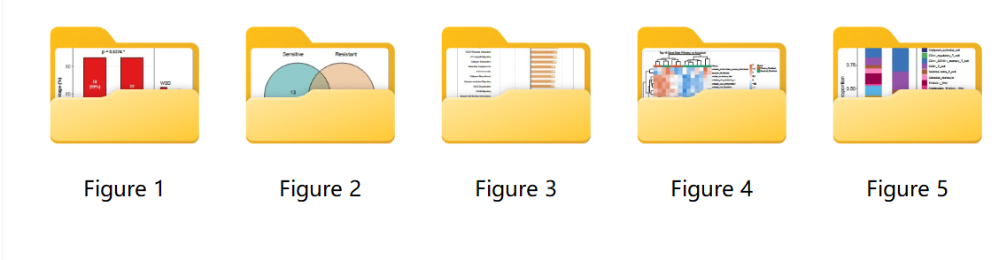
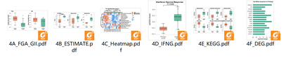
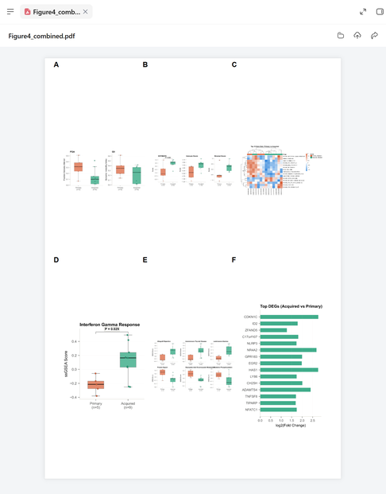
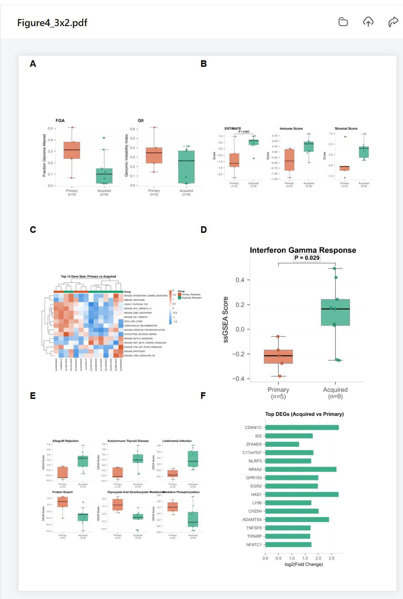
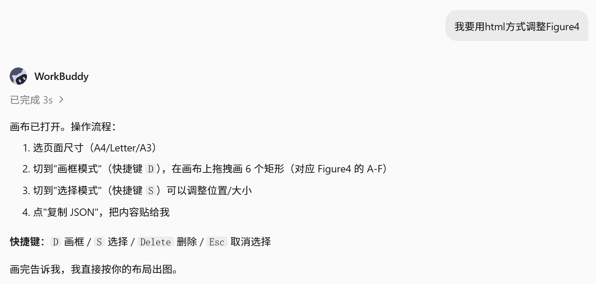
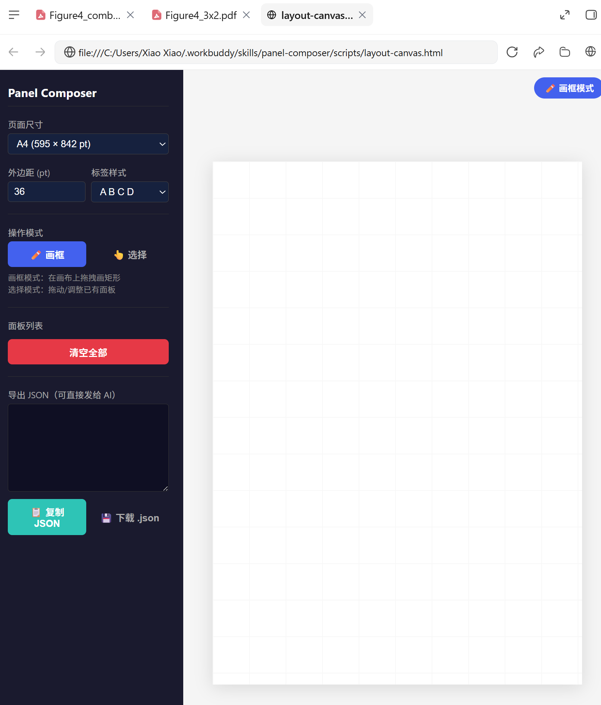
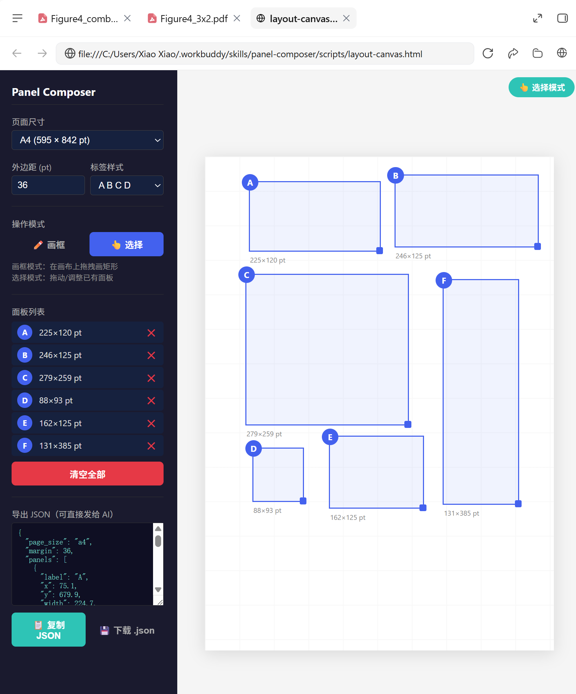
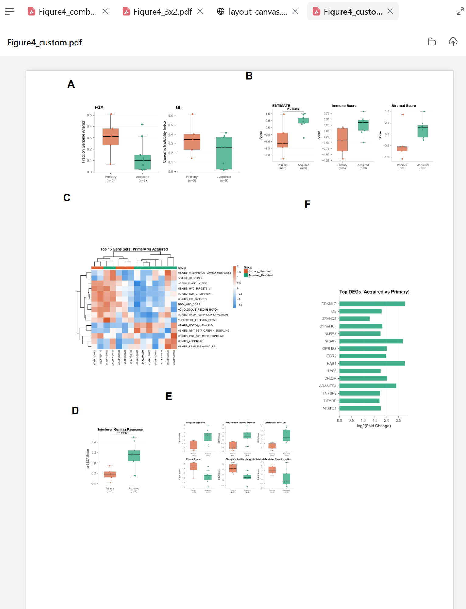

# Panel Composer

将多个 panel 组合成一张大图的通用工具。

支持 PDF、PNG、JPG、TIFF、BMP 混合输入，提供三种布局方式：**AI 自动布局**、**可视化画布拖拽**、**自然语言对话**。

**全程无需写代码**——只需在对话中用自然语言描述，或在画布上拖拽，即可生成组合图。

### 📦 下载

- **最新版（v0.5.0）**：[panel-composer-v0.5.0.zip](panel-composer-v0.5.0.zip)
- 或前往 [Releases 页面](https://github.com/xxiao-git/panel-composer/releases) 查看历史版本

---

## 目录

- [安装](#安装)
- [快速开始](#快速开始)
- [三种布局方式](#三种布局方式)
- [常见问题](#常见问题)
- [进阶使用](#进阶使用)
- [API 参考](#api-参考)

---

## 安装

### 通过 AI 助手安装（推荐）

如果你使用的是 [WorkBuddy](https://www.codebuddy.cn/workbuddy)，可以直接在对话中让 AI 帮你安装：

**从 GitHub 安装：**

在对话中直接说：

> "帮我从 GitHub 安装 panel-composer 技能，仓库地址：https://github.com/xxiao-git/panel-composer"

或者：

> "安装技能 https://github.com/xxiao-git/panel-composer"

AI 会自动从 GitHub 克隆仓库并安装到本地技能目录。

**从本地 zip 包安装：**

如果你有打包好的 zip 文件，可以在对话中说：

> "帮我安装这个技能包"，然后把 zip 文件发给 AI

AI 会自动解压并安装。

**安装完成后，即可在对话中直接使用：**

> "用 panel-composer 把这 4 个 PDF 拼成 2x2 的图"

### 手动安装

如果不用 AI 助手，也可以手动安装：

1. 克隆或下载本仓库
2. 将 `panel-composer` 文件夹复制到 WorkBuddy 技能目录：
   - Windows: `C:\Users\<用户名>\.workbuddy\skills\panel-composer\`
   - macOS/Linux: `~/.workbuddy/skills/panel-composer/`
3. 安装 Python 依赖（仅需一次）：

```bash
pip install reportlab PyMuPDF Pillow
```

### 环境要求

- Python 3.7+
- 支持 Windows / macOS / Linux
- 依赖：`reportlab`、`PyMuPDF`、`Pillow`

---

## 快速开始

安装完成后，在对话中直接说：

> "帮我把 a.pdf、b.pdf、c.pdf、d.pdf 拼成 2x2 的图，加上标签"

AI 会自动调用 panel-composer 技能，生成一张 2x2 网格的组合图，并加上 A、B、C、D 标签。

### 完整流程演示

下面用实际案例演示从"一堆散落的 panel"到"一张组合大图"的完整流程。

**第 1 步：你的文件**

假设你有一个 `FigureProduction` 文件夹，里面按 Figure 分好了子文件夹，每个子文件夹里是独立的 panel：



**第 2 步：一句话批量组合**

不需要逐个文件夹操作，直接告诉 AI 要组合哪些：

> "帮我组合 FigureProduction 中 Figure1 到 Figure5 的所有图片"

AI 会一次性处理，自动生成 Figure1 ~ Figure5 五张组合大图。这就是 **批量处理** 的威力——你不需要手动打开每个文件夹、逐个组合，一句话搞定所有。

**第 3 步：了解 panel 命名规则（以 Figure 4 为例）**

每个 Figure 文件夹里的 panel 按字母命名（A、B、C、D...），这些字母最终会变成组合图上的标签：



> **注意**：这一步只是为了让你了解 panel 是怎么命名的。实际使用中你不需要手动打开文件夹，AI 会自动识别。

**第 4 步：自动布局效果**

以 Figure 4 为例，6 个 panel 自动生成 2x3 网格布局，加上 A-F 标签：



**第 5 步：对话微调（可选）**

默认布局不满意，用自然语言调整：

> "调整 Figure4，第一行 AB，第二行 CD，第三行 EF"

AI 重新排列成 3x2 布局：



就这么简单。整个流程你只需要说话，不需要写代码，不需要手动操作文件。

---

## 三种布局方式

Panel Composer 提供三种布局方式，适配不同场景。默认使用 AI 自动布局，不满意时可以切换。

### 方式一：AI 自动布局（默认）

**适用场景**：快速出图，不需要精确控制位置。

**用法**：直接对话

> "帮我把这 6 个 panel 拼成一张图"

> "a.pdf b.pdf c.pdf d.pdf 自动排一下"

AI 会根据 panel 数量自动选择最接近正方形的网格（如 4 个 → 2x2，6 个 → 2x3），并输出组合图。

---

### 方式二：HTML 画布布局（可视化拖拽）

**适用场景**：需要精确控制每个 panel 的位置和大小，但不想使用专业软件或写代码。

**流程演示**：

1. 在对话中说"用 html 方式调整"，AI 自动打开画布：



2. 画布界面：左侧设置页面尺寸/标签样式/操作模式，右侧是网格画布。



3. 切换到"画框模式"（快捷键 `D`），在画布上拖拽画矩形，每个矩形自动标记为 A、B、C...



4. 画完后点击"复制 JSON"，把 JSON 发给 AI，AI 立即按你的布局生成组合图：



**放心拖拽**：无论你在画布上拖出什么比例的框，panel 内容始终保持原始宽高比，不会被拉伸变形。如果框的比例和原图不一致，原图会在框内等比缩放居中，多余空间留白。你只需要关心位置和大致大小。

**快捷键**：
- `D` — 切换到画框模式
- `S` — 切换到选择模式
- `Delete` — 删除选中的面板

---

### 方式三：对话式布局（自然语言描述）

**适用场景**：自动布局不满意，但又不想用画布。直接用文字描述你想要的布局。

**示例**：

> "上面两个 A B 并排，下面 C 占满整行"

> "左边 A 占一半高度，右边 B C D 竖着排"

> "A 大一点放左上，B C D 小一点在右下一列"

> "第一排 3 个，第二排 2 个居中"

AI 会理解你的描述，自动计算每个 panel 的位置和大小，生成组合图。

---

## 常见问题

### Q: Panel 会被拉伸变形吗？

**不会**。无论哪种布局方式，panel 内容始终保持原始宽高比，等比缩放居中。如果指定区域比例与原图不一致，周围自动留白。

### Q: 支持哪些输入格式？

PDF、PNG、JPG、TIFF、BMP，可以混合使用。比如同时传入 PDF 和 PNG，工具会自动处理。

### Q: 输出格式是什么？

默认输出 PDF（矢量，适合投稿）。也可以指定输出 PNG（光栅化，可调 DPI）：

> "输出 PNG 格式，600 DPI"

### Q: 标签可以自定义吗？

可以。默认是 A、B、C、D...，也可以改为 1、2、3、4... 或 a、b、c、d...：

> "标签改成数字"

> "标签用小写字母"

也可以调整标签位置和大小：

> "标签放到右下角"

> "标签大一点"

### Q: 画布上的 JSON 是什么？

JSON 是画布导出的布局配置，包含每个 panel 的位置和大小信息。你可以保存它，下次组图时直接加载，不用重新拖拽。

### Q: 页面尺寸可以改吗？

可以。默认 A4，也可以改为 Letter 或 A3：

> "页面改成 Letter 尺寸"

### Q: 可以加边框吗？

目前版本不支持边框，但可以在专业软件（如 Affinity Designer、Adobe Illustrator）中后期添加。

---

## 进阶使用

### 保存和复用布局

如果你经常用某种固定布局（比如 2x2、1+3），可以让 AI 保存布局模板：

> "把这个布局保存为模板，以后直接用"

下次直接说：

> "用 2x2 模板组图"

### 与其他工具配合

Panel Composer 解决的是"快速把多个 panel 拼成一张图"的重复劳动——比你在专业软件里一个个打开、对齐、导出要快得多。

但如果你的场景需要更精细的个性化排版（比如复杂的标注系统、品牌化设计、特殊视觉效果、印刷级色彩管理等），建议：

1. **用 Panel Composer 快速出初版** — 确定 panel 位置、大小、标签
2. **导出为 PDF** — 保留矢量质量
3. **在专业软件中继续打磨**：
   - **Affinity Designer / Adobe Illustrator** — 矢量编辑、精细标注、品牌配色
   - **Adobe Photoshop** — 位图处理、色彩校正、特殊效果
   - **Inkscape**（免费）— 开源矢量编辑

这样你省掉了最耗时的"对齐和定位"环节，把精力集中在真正需要手工调整的细节上。

---

## API 参考

> 以下内容面向需要直接调用 Python API 的开发者。普通用户无需关注。

### 基本调用

```python
from compose import compose_figure

compose_figure(
    panels=["a.pdf", "b.png", "c.jpg"],
    output="figure.pdf",
    labels=True,
)
```

### 参数一览

| 参数 | 类型 | 默认值 | 说明 |
|------|------|--------|------|
| `panels` | list | **必填** | 文件路径列表（PDF/PNG/JPG/TIFF/BMP，可混合） |
| `output` | str | **必填** | 输出文件路径（`.pdf` 或 `.png`） |
| `layout` | str | `"auto"` | `grid` / `auto` / `custom` / `mixed` |
| `rows` / `cols` | int | None | 网格行列数（`layout="grid"` 时必填） |
| `json_layout` | str/dict | None | JSON 布局文件或 dict（优先级最高） |
| `page_size` | str/tuple | `"a4"` | `"a4"` / `"letter"` / `"a3"` / `"a5"` / `(w, h)` |
| `margin` | int | 36 | 外边距（pt） |
| `spacing` | int | 12 | panel 间距（pt） |
| `labels` | bool | False | 是否添加标签 |
| `label_style` | str | `"uppercase"` | `uppercase` (A,B,C) / `numeric` (1,2,3) / `lowercase` (a,b,c) |
| `label_font_size` | int | 14 | 标签字号（pt） |
| `label_offset` | tuple | `(-18, -18)` | 标签偏移 `(x, y)`（pt） |
| `dpi` | int | 300 | PNG 分辨率 |
| `background_color` | str | `"white"` | 背景色（PNG 输出时生效） |

### JSON 布局格式

```json
{
  "page_size": "a4",
  "margin": 36,
  "panels": [
    {"label": "A", "x": 50, "y": 400, "width": 200, "height": 150},
    {"label": "B", "x": 270, "y": 400, "width": 200, "height": 150}
  ]
}
```

- `x`, `y`：左下角坐标（PDF 坐标系，原点在页面左下角）
- `width`, `height`：面板尺寸（pt，1 pt = 1/72 inch）

### CLI

```bash
python scripts/compose.py output.pdf panel1.pdf panel2.png panel3.jpg
python scripts/compose.py output.pdf --grid 2 3 panel1.pdf panel2.png ...
```

---

## 许可证

MIT License

---

## 反馈与支持

如有问题或建议，欢迎提 Issue 或 PR。
